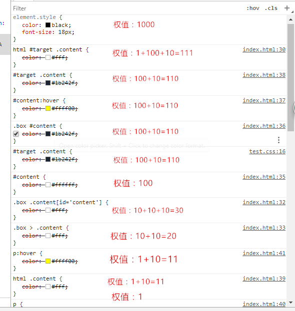

# CSS选择器权值计算

## 权重计算规则

|选择器|表达式|权值|
|--------------------|--------------------------------------|--------|
|内联样式  		     |如：style=""							| 1000
|ID选择器    		 |如：#content					    	| 100
|类选择器、属性选择器|如.content， [title='']		    	| 10
|伪类选择器          |如:link，:hover，:target，:root等 	| 10
|标签选择器			 |如div，p								| 1
|伪元素				 |如::first-letter,::first-line,::before| 1
|通配符选择			 |*	 									| 0
|继承的样式			 |  ---									|无权值

最后，!important 的作用是提升优先级，加了这句的样式的优先级是最高的（比内联样式的优先级还高)。
    p{color:red !important;}

## CSS 优先级法则
1. 选择器都有一个权值，权值越大越优先
2. 当权值相等时，后出现的样式表设置要优于先出现的样式表设置
3. 创作者的规则高于浏览者：即网页编写者设置的CSS 样式的优先权高于浏览器所设置的样式
4. 继承的CSS 样式不如后来指定的CSS 样式
5. 在同一组属性设置中标有“!important”规则的优先级最大
6. 相邻选择器、兄弟选择器、子元素选择器 selecter + selecter	拆分为两个选择器再计算	 

## 实例
这里可以看到谷歌浏览器已经把样式的优先级从大到小排好了。

 
